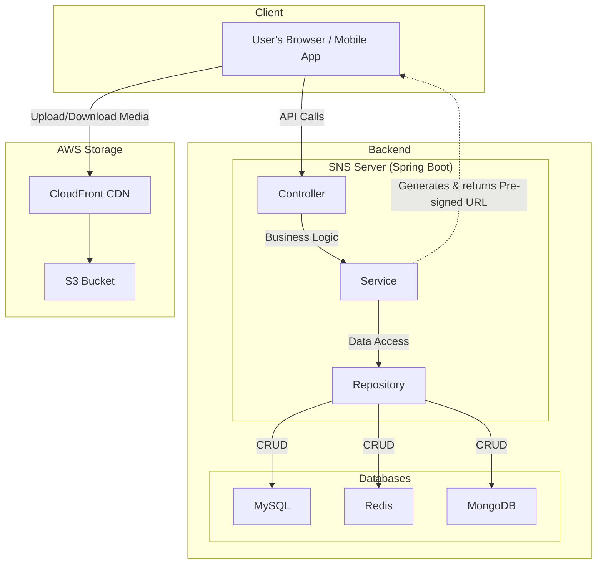

## 🏛️ 아키텍처

```mermaid
graph TD
    subgraph Client
        ClientApp["User's Browser / Mobile App"]
    end

    subgraph Backend
        direction LR
        subgraph "SNS Server (Spring Boot)"
            Controller["Controller"]
            Service["Service"]
            Repository["Repository"]
        end
        subgraph "Databases"
            MySQL["MySQL"]
            Redis["Redis"]
            MongoDB["MongoDB"]
        end
    end


    subgraph "AWS Storage"
        CloudFront["CloudFront CDN"]
        S3["S3 Bucket"]
    end

    %% Flows
    ClientApp -- API Calls --> Controller
    Controller -- Business Logic --> Service
    Service -- Data Access --> Repository
    Repository -- CRUD --> MySQL & Redis & MongoDB

    ClientApp -- Upload/Download Media --> CloudFront
    CloudFront --> S3

    Service -.->|Generates & returns Pre-signed URL| ClientApp
```